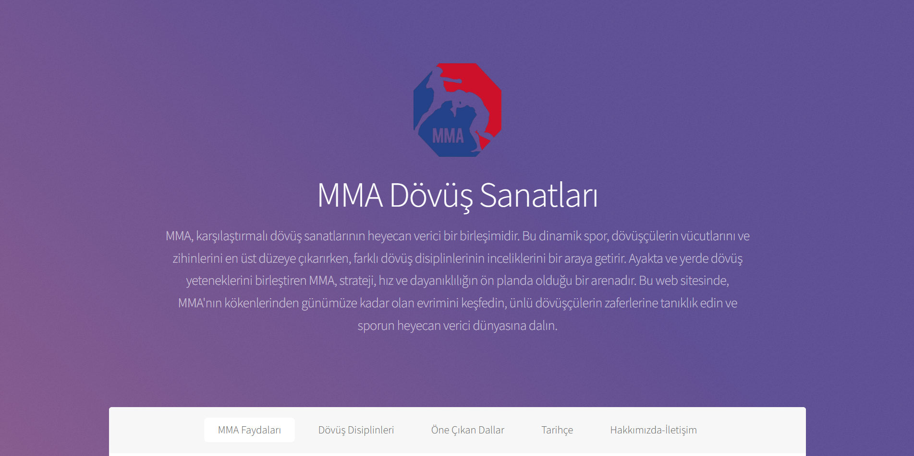
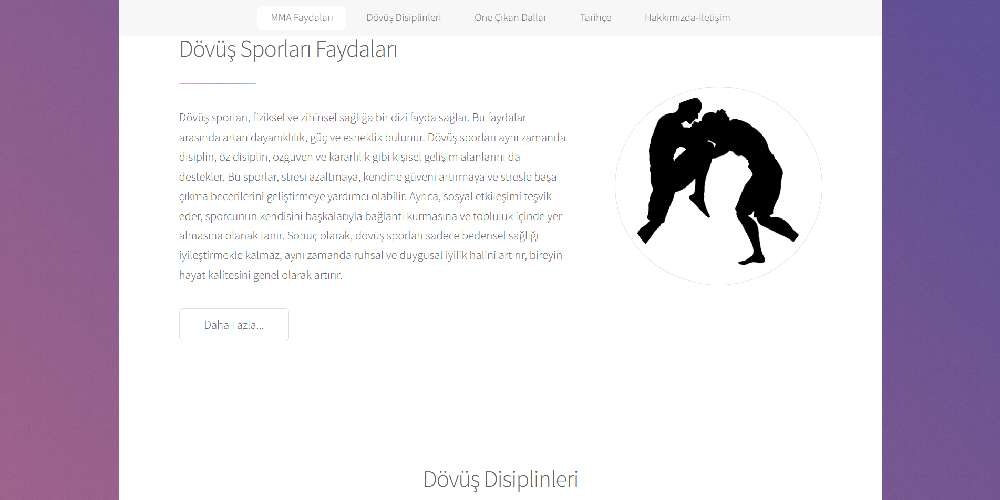
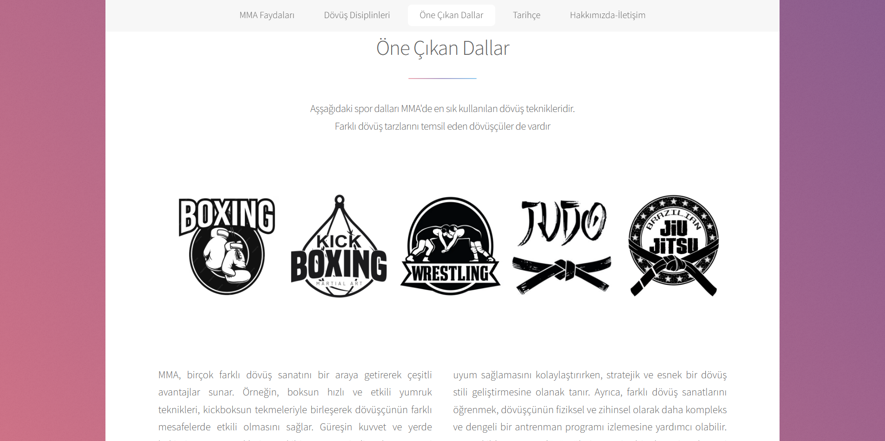

# 🥋 MMA Website Prototype — Static Landing Page • (Archived)

 

## 📌 Project Overview

This project is a **static landing page** built by taking an existing **HTML/CSS template** and customizing it with **updated styles and structure**.  
The goal was to practice working with pre-built templates, modifying layouts, and applying responsive design techniques without using any frameworks or JavaScript.  
> 📦 **Archived** — This project is no longer being updated. It’s kept as part of my learning history and serves as a technical reference for future projects.

 

## 🖼️ Screenshots
Shown below in order:  
**1. Landing** · **2. Benefits** · **3. Diciplines** 
**4. Highlighted Branches**

  
  
  

  
  
  

 

## 🧰 Tech Stack

  
  

 

## 📜 License
This project is licensed under the [MIT License](./LICENSE).

---

© 2025 Yusuf Okan Sirkeci — [Hereetria](https://github.com/Hereetria)
